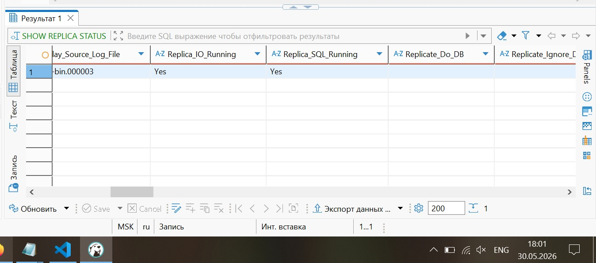
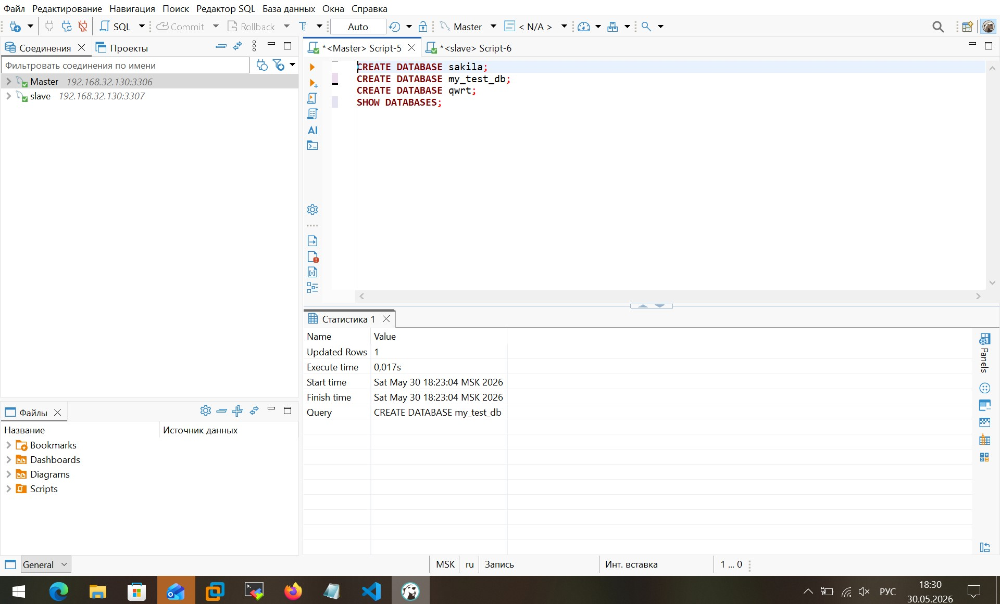
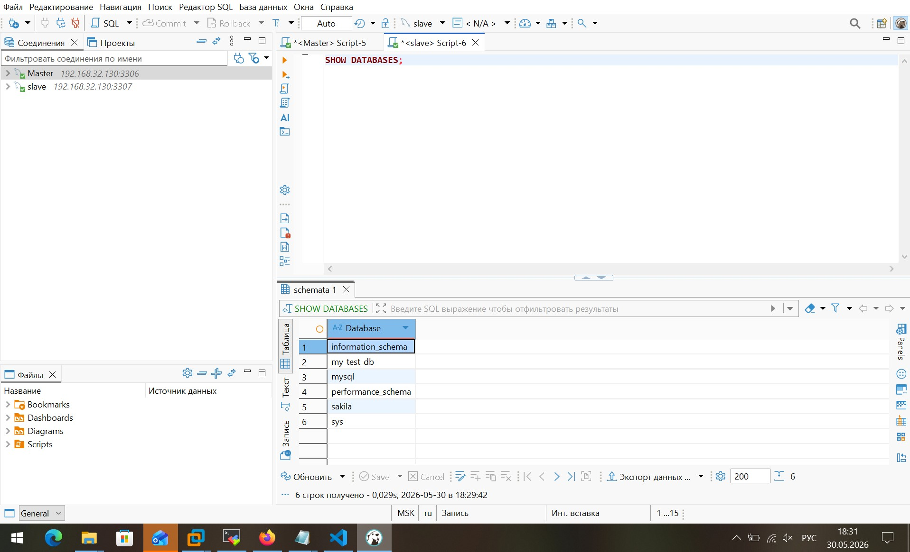
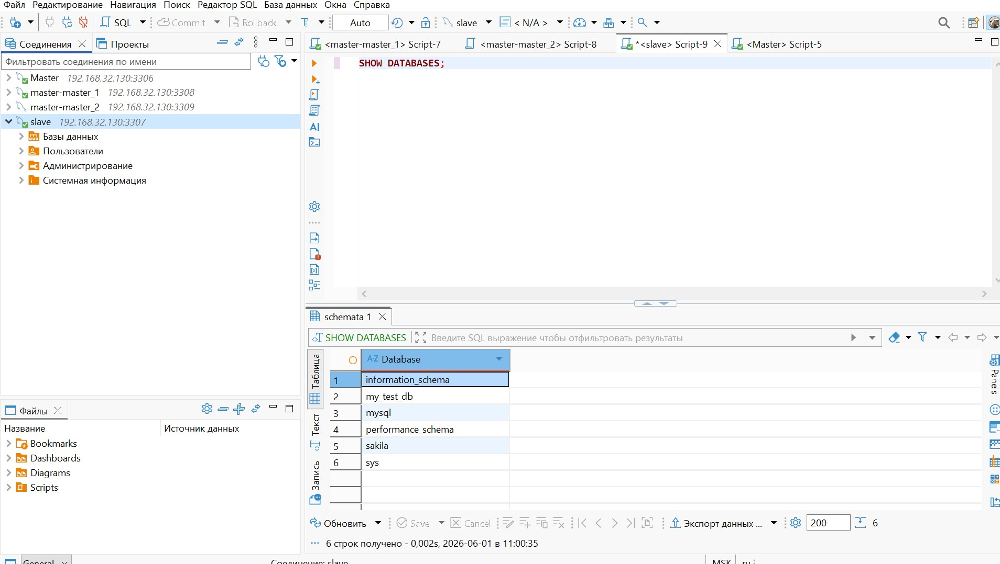
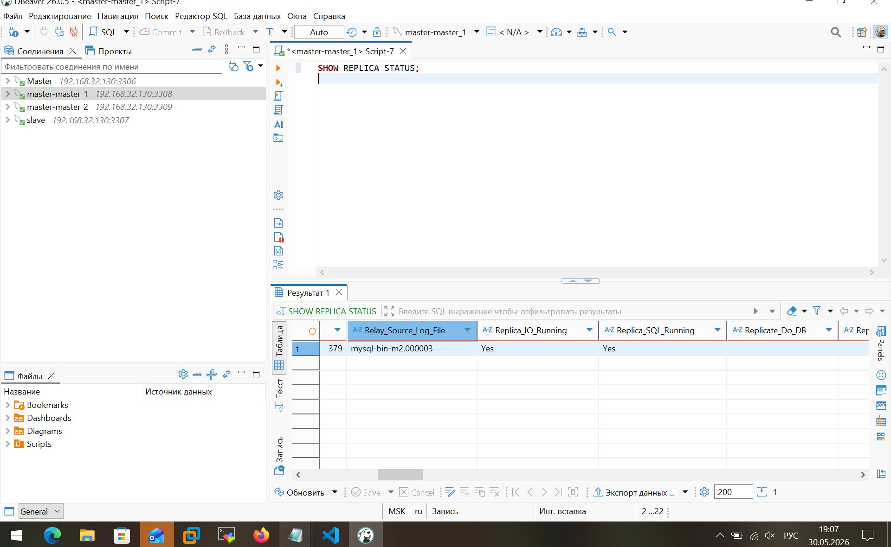
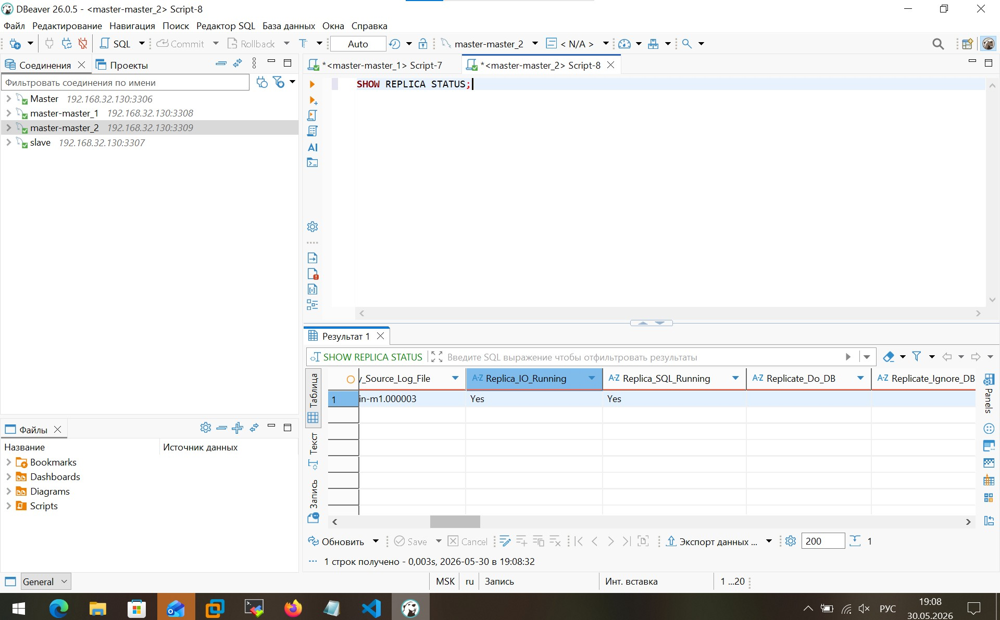
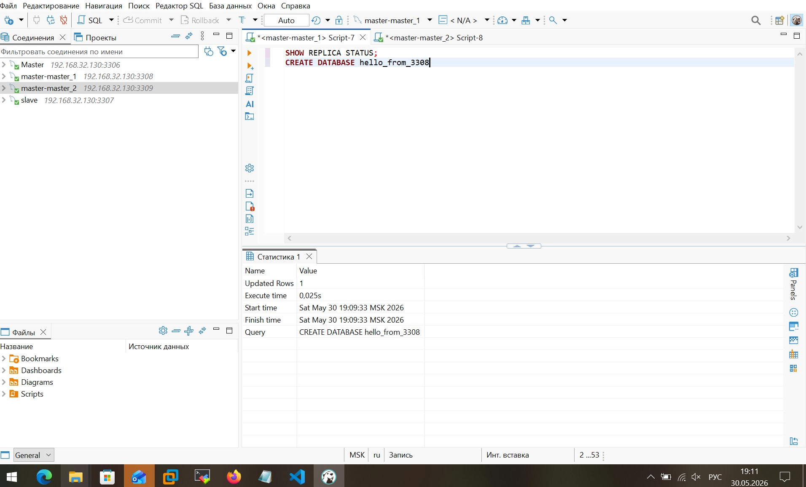
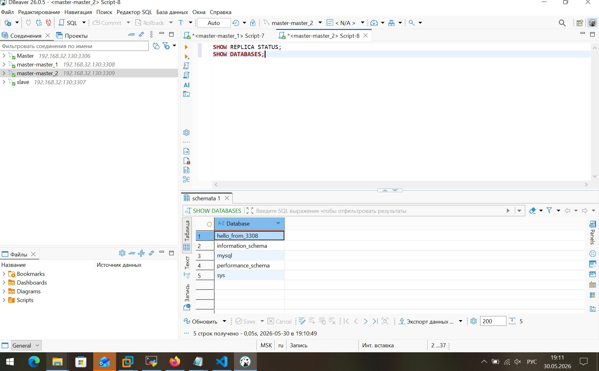
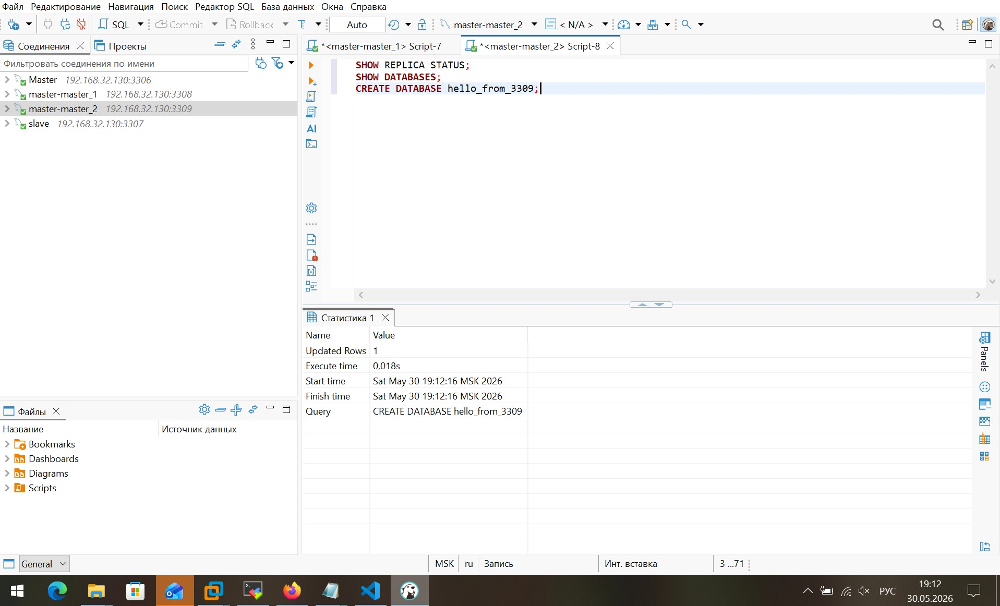
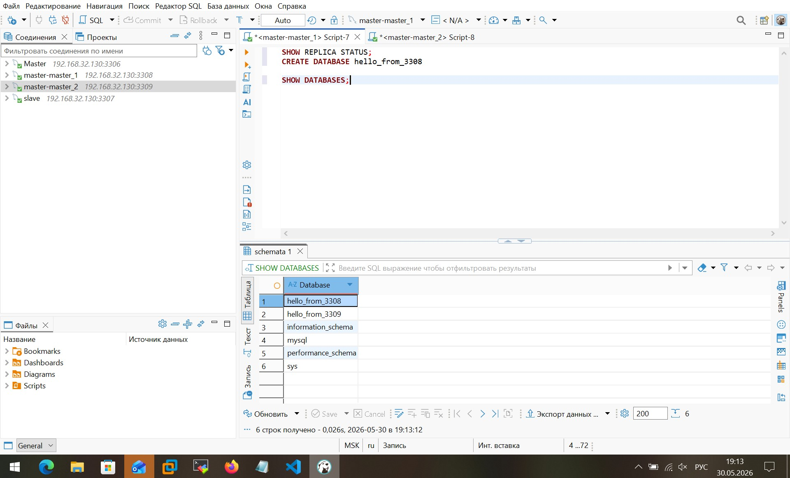

# Домашнее задание к занятию «Репликация и масштабирование. Часть 1» - Бобков Александр

### Задание 1

На лекции рассматривались режимы репликации master-slave, master-master, опишите их различия.

*Ответить в свободной форме.*

---

### Задание 2

Выполните конфигурацию master-slave репликации, примером можно пользоваться из лекции.

*Приложите скриншоты конфигурации, выполнения работы: состояния и режимы работы серверов.*

---

## Дополнительные задания (со звёздочкой*)
Эти задания дополнительные, то есть не обязательные к выполнению, и никак не повлияют на получение вами зачёта по этому домашнему заданию. Вы можете их выполнить, если хотите глубже шире разобраться в материале.

---

### Задание 3* 

Выполните конфигурацию master-master репликации. Произведите проверку.

*Приложите скриншоты конфигурации, выполнения работы: состояния и режимы работы серверов.*


### Ответ на Задание 1.


- Репликация — это процесс копирования данных с одного сервера на другой в режиме реального времени.

#### 1. Режим master-slave (Главный — Подчинённый)
В этой схеме роли серверов строго разделены:
* **Master (Главный):** Принимает абсолютно любые запросы от сайта или пользователя: и на чтение, и на изменение данных. Все новые записи он заносит в свой бинарный лог.
* **Slave (Подчинённый):** Работает строго в режиме «Только для чтения». Он непрерывно читает лог Мастера по сети и повторяет все изменения у себя.
* **Главный плюс:** распределяет нагрузку на чтение (пользователи смотрят товары на Слейве, а оформляют заказы на Мастере).
* **Главный минус:** если Мастер «упадет», сайт временно перестает принимать новые записи, пока администратор вручную не сделает Слейв новым главным сервером.

#### 2. Режим master-master (Главный — Главный)
В этой схеме оба сервера являются абсолютно равноправными:
* Оба сервера одновременно могут принимать и чтение, и запись. Изменения передаются друг другу в обоих направлениях.
* **Главный плюс:** Высокая отказоустойчивость. Если один сервер выйдет из строя, сайт мгновенно переключится на запись во второй без пауз в работе.
* **Главный минус:** Сложная архитектура. Возникает риск **конфликтов репликации**, если одну и ту же строчку изменят одновременно на двух разных серверах (база запутается, какое изменение верное).

---

### Ответ на Задание 2 и 3* 

* **Делать буду сразу 2 и 3* задания используя docker-compos.yaml*

## 📂 Структура папок проекта

Создаю внутри проекта следующую структуру. 

Разложите файлы ровно по этой схеме:
* `.env` — здесь хранятся пароли
* `docker-compose.yml` — главный сценарий Docker
* `master.cnf` — настройки Мастера (Задание 2)
* `slave.cnf` — настройки Слейва (Задание 2)
* `master1.cnf` — настройки Первого Мастера (Задание 3*)
* `master2.cnf` — настройки Второго Мастера (Задание 3*)
* `/init/master-init.sql` — скрипт автозапуска для Мастера
* `/init/slave-init.sql` — скрипт автозапуска для Слейва
* `/init/mm1-init.sql` — скрипт автозапуска для Master-Master 1
* `/init/mm2-init.sql` — скрипт автозапуска для Master-Master 2

---


### 📄 Файл 1: `.env`
```env
MYSQL_ROOT_PASSWORD=supersecretpass2026
MYSQL_REPL_USER=repl_user
MYSQL_REPL_PASSWORD=my_secure_repl_password_123
```

### 📄 Файл 2: `master.cnf`
```ini
[mysqld]
# Уникальный номер сервера в сети репликации. У главного сервера всегда ставится 1.
server-id = 1

# Включаем запись бинарного лога изменений и задаем префикс для его файлов.
log-bin = mysql-bin

# ПЕРЕЧИСЛЯЕМ БАЗЫ, КОТОРЫЕ РАЗРЕШЕНО РЕПЛИЦИРОВАТЬ:
binlog_do_db = sakila
binlog_do_db = my_test_db     # Добавили вторую базу в белый список!

```

### 📄 Файл 3: `slave.cnf`
```ini
[mysqld]
# Уникальный номер подчиненного сервера. Он обязан отличаться от ID мастера, ставим 2.
server-id = 2

# Включаем ведение ретрансляционного лога (Relay Log) для временного хранения логов мастера.
relay-log = mysql-relay-bin

# Защищаем базу: запрещаем локальное изменение данных на Слейве. Изменения идут только от Мастера.
read_only = 1

```

### 📄 Файл 4: `master1.cnf`
```ini
[mysqld]
server-id = 10
log-bin = mysql-bin-m1
# Шаг инкремента для генерации автоинкрементных ID (чтобы ключи не пересекались)
auto_increment_increment = 2
# Начальное смещение. Этот сервер будет создавать строки с ID: 1, 3, 5, 7, 9...
auto_increment_offset = 1
```

### 📄 Файл 5: `master2.cnf`
```ini
[mysqld]
server-id = 20
log-bin = mysql-bin-m2
# Шаг инкремента равен двум, как и на первом сервере
auto_increment_increment = 2
# Начальное смещение равно двум. Этот сервер будет создавать строки с ID: 2, 4, 6, 8, 10...
auto_increment_offset = 2
```

---

## SQL-скрипты автоматической инициализации (Папка `init`)


### 📄 Файл 6: `init/master-init.sql`
```sql
-- Универсальное правило: создаем (или обновляем) root для доступа со ВСЕХ внешних сетей
CREATE USER IF NOT EXISTS 'root'@'%' IDENTIFIED WITH mysql_native_password BY 'supersecretpass2026';
GRANT ALL PRIVILEGES ON *.* TO 'root'@'%' WITH GRANT OPTION;

-- Настройка технического пользователя репликации
DROP USER IF EXISTS 'repl_user'@'%';
CREATE USER 'repl_user'@'%' IDENTIFIED WITH mysql_native_password BY 'my_secure_repl_password_123';
GRANT REPLICATION SLAVE ON *.* TO 'repl_user'@'%';

-- Сохраняем изменения в памяти СУБД
FLUSH PRIVILEGES;
```

### 📄 Файл 7: `init/slave-init.sql`
```sql
-- 1. Связываем Слейв с Мастером по фиксированным стартовым координатам.
-- В MASTER_HOST пишу имя сервиса 'mysql-master' — Docker внутри сети сам сопоставит его с IP-адресом.
CHANGE MASTER TO
  MASTER_HOST='mysql-master',                    -- Указываем имя контейнера-источника в сети Docker
  MASTER_USER='repl_user',                        -- Учетная запись для подключения (создана в master-init.sql)
  MASTER_PASSWORD='my_secure_repl_password_123',  -- Пароль пользователя репликации
  MASTER_LOG_FILE='mysql-bin.000001',             -- Стартовый лог-файл «чистого» Мастера
  MASTER_LOG_POS=157;                             -- Точная стартовая позиция «чистого» Мастера

-- 2. Включаем фоновые потоки репликации (скачивание логов и применение изменений)
START SLAVE;

```

### 📄 Файл 8: `init/mm1-init.sql`
```sql
-- Универсальное правило: открываем root доступ со всех внешних хостов
CREATE USER IF NOT EXISTS 'root'@'%' IDENTIFIED WITH mysql_native_password BY 'supersecretpass2026';
GRANT ALL PRIVILEGES ON *.* TO 'root'@'%' WITH GRANT OPTION;

-- Настройка пользователя репликации
DROP USER IF EXISTS 'repl_user'@'%';
CREATE USER 'repl_user'@'%' IDENTIFIED WITH mysql_native_password BY 'my_secure_repl_password_123';
GRANT REPLICATION SLAVE ON *.* TO 'repl_user'@'%';
FLUSH PRIVILEGES;

-- Автоматическая привязка к соседу
CHANGE MASTER TO MASTER_HOST='mm-master2', MASTER_USER='repl_user', MASTER_PASSWORD='my_secure_repl_password_123', MASTER_LOG_FILE='mysql-bin-m2.000001', MASTER_LOG_POS=157;
START SLAVE;

```

### 📄 Файл 9: `init/mm2-init.sql`
```sql
-- Универсальное правило: открываем root доступ со всех внешних хостов
CREATE USER IF NOT EXISTS 'root'@'%' IDENTIFIED WITH mysql_native_password BY 'supersecretpass2026';
GRANT ALL PRIVILEGES ON *.* TO 'root'@'%' WITH GRANT OPTION;

-- Настройка пользователя репликации
DROP USER IF EXISTS 'repl_user'@'%';
CREATE USER 'repl_user'@'%' IDENTIFIED WITH mysql_native_password BY 'my_secure_repl_password_123';
GRANT REPLICATION SLAVE ON *.* TO 'repl_user'@'%';
FLUSH PRIVILEGES;

-- Автоматическая привязка к соседу
CHANGE MASTER TO MASTER_HOST='mm-master1', MASTER_USER='repl_user', MASTER_PASSWORD='my_secure_repl_password_123', MASTER_LOG_FILE='mysql-bin-m1.000001', MASTER_LOG_POS=157;
START SLAVE;

```

---

## 📄 Файл 10: Настройка сценария `docker-compose.yml`


* **`version: '3.8'`** — указывает Docker Compose, какую версию стандартов использовать для чтения этого файла.
* **`networks`** — раздел для настройки сети. Здесь созда. общую изолированную виртуальную сеть `replication_net` с драйвером `bridge`. Этот «мост» позволяет контейнерам общаться друг с другом напрямую по текстовым именам сервисов (как по доменным именам), полностью заменяя сложные IP-адреса.
* **`services`** — главный раздел, где перечисляются все запускаемые контейнеры (серверы базы данных).

```yaml

# ==============================================================================
# ФАЙЛ ОРКЕСТРАЦИИ: docker-compose.yml
# Описание: Автоматическое развертывание репликации MySQL (Master-Slave и Master-Master)
# ==============================================================================

version: '3.8' # Определяет версию стандарта Docker Compose и доступный набор инструкций.

networks:
  replication_net:
    driver: bridge # Создает изолированную внутреннюю сеть (виртуальный коммутатор).
                   # Контейнеры внутри нее общаются напрямую по именам своих сервисов
                   # (например, 'mysql-master'), игнорируя внешние IP-адреса хоста.

services:
  # ============================================================================
  # ЗАДАНИЕ 2: ИНФРАСТРУКТУРА MASTER-SLAVE (ГЛАВНЫЙ - ПОДЧИНЕННЫЙ)
  # ============================================================================
  
  # mysql-master — уникальное имя службы главного сервера в  внутренней сети
  mysql-master:
    image: mysql:8.0 # Скачивает официальный стабильный образ СУБД MySQL версии 8.0 с Docker Hub.
    container_name: mysql-master # Фиксирует имя контейнера для удобного управления через терминал (docker logs/ps).
    
    # command принудительно переопределяет стартовую команду СУБД:
    # 1. --default-authentication-plugin=mysql_native_password — включает совместимый метод проверки паролей.
    # 2. --bind-address=0.0.0.0 — заставляет MySQL слушать сетевые пакеты со всех интерфейсов хоста.
    command: --default-authentication-plugin=mysql_native_password --bind-address=0.0.0.0
    
    environment:
      # MYSQL_ROOT_PASSWORD — задает главный пароль root-пользователя. Конструкция ${...} 
      # автоматически и безопасно считывает значение из скрытого файла переменных окружения '.env'.
      MYSQL_ROOT_PASSWORD: ${MYSQL_ROOT_PASSWORD}
      
      # MYSQL_ROOT_HOST: '%' — критически важная переменная. Стирает стандартное ограничение 'localhost'
      # и разрешает root подключаться в DBeaver с любых внешних IP-адресов (включая шлюз моей Docker-сети 192.168.32.1).
      MYSQL_ROOT_HOST: '%'
      
    ports:
      - "3306:3306" # Проброс портов: [Внешний порт вашего компьютера] : [Внутренний порт контейнера].
                    # Главный сервер будет доступен в DBeaver на стандартном порту 3306.
                    
    volumes:
      # Volumes монтируют (прокидывают) файлы и папки с моего компьютера внутрь контейнера:
      - ./master.cnf:/etc/mysql/conf.d/master.cnf # Подкладывает  настройки репликации в конфигурацию MySQL.
      
      # Директория /docker-entrypoint-initdb.d/ — встроенный инструмент автоматизации Docker.
      # Все находящиеся здесь .sql скрипты автоматически выполняются базой данных строго ОДИН раз при первом старте.
      - ./init/master-init.sql:/docker-entrypoint-initdb.d/master-init.sql
      
    networks:
      - replication_net # Помещает контейнер Мастера в  общую изолированную сеть.

  # mysql-slave — подчиненный сервер (реплика Мастера)
  mysql-slave:
    image: mysql:8.0
    container_name: mysql-slave
    command: --default-authentication-plugin=mysql_native_password --bind-address=0.0.0.0
    environment:
      MYSQL_ROOT_PASSWORD: ${MYSQL_ROOT_PASSWORD}
      MYSQL_ROOT_HOST: '%' # Открывает беспрепятственный доступ для root-пользователя в DBeaver на порт 3307
    ports:
      - "3307:3306" # Пробрасывает Слейв наружу на соседний порт 3307, чтобы избежать конфликта за порт 3306 с Мастером.
    volumes:
      - ./slave.cnf:/etc/mysql/conf.d/slave.cnf # Подкладывает настройки репликации (включая флаг read_only = 1).
      - ./init/slave-init.sql:/docker-entrypoint-initdb.d/slave-init.sql # Скрипт автоматической связки логов при старте.
    depends_on:
      - mysql-master # Порядок запуска: Слейв начнет включаться строго ПОСЛЕ успешного поднятия контейнера Мастера.
    networks:
      - replication_net

  # ============================================================================
  # ЗАДАНИЕ 3*: ИНФРАСТРУКТУРА MASTER-MASTER (ГЛАВНЫЙ - ГЛАВНЫЙ)
  # ============================================================================
  
  # mm-master1 — первый равноправный главный сервер из пары двусторонней репликации
  mm-master1:
    image: mysql:8.0
    container_name: mm-master1
    command: --default-authentication-plugin=mysql_native_password --bind-address=0.0.0.0
    environment:
      MYSQL_ROOT_PASSWORD: ${MYSQL_ROOT_PASSWORD}
      MYSQL_ROOT_HOST: '%' # Разрешает внешнее root-подключение для DBeaver на порт 3308
    ports:
      - "3308:3306" # Доступен на моем компьютере через порт 3308.
    volumes:
      - ./master1.cnf:/etc/mysql/conf.d/master1.cnf # Настройки ID сервера и нечетного шага автоинкремента.
      - ./init/mm1-init.sql:/docker-entrypoint-initdb.d/mm1-init.sql # Скрипт автоматического закольцовывания на mm-master2.
    networks:
      - replication_net

  # mm-master2 — второй равноправный главный сервер из пары двусторонней репликации
  mm-master2:
    image: mysql:8.0
    container_name: mm-master2
    command: --default-authentication-plugin=mysql_native_password --bind-address=0.0.0.0
    environment:
      MYSQL_ROOT_PASSWORD: ${MYSQL_ROOT_PASSWORD}
      MYSQL_ROOT_HOST: '%' # Разрешает внешнее root-подключение для DBeaver на порт 3309
    ports:
      - "3309:3306" # Доступен на моем компьютере через порт 3309.
    volumes:
      - ./master2.cnf:/etc/mysql/conf.d/master2.cnf # Настройки ID сервера и четного шага автоинкремента.
      - ./init/mm2-init.sql:/docker-entrypoint-initdb.d/mm2-init.sql # Скрипт автоматического закольцовывания на mm-master1.
    networks:
      - replication_net

```

### Скриншоты:

----
----
## Скриншоты по заданию 2

**Скриншот статуса Slave Задание 2 порт 3307 (DBeaver):**


**Скриншот создания трех баз на Master Задание 2 порт 3306, создаю 3 базы, 2 разрешенные (sakila, my_test_db) одну нет(qwrt)  (DBeaver):**


**Скриншот созданных баз на Master Задание 2 порт 3306 (DBeaver):**


- Как видим создались только две базы с разоешенными названиями из файла `master.cnf`.


**Скриншот созданных баз на Slave Задание 2 порт 3307 (DBeaver):**


- Видим, что реплицировались 2 базы `(sakila, my_test_db)`.

-----
-----

## Скриншоты по заданию 3*

**Скриншот статуса репликации Задание 3 порт 3308  "Мастер 1" (DBeaver):**


**Скриншот статуса репликации Задание 3 порт 3309  "Мастер 2" (DBeaver):**


**Скриншот статуса создания базы `hello_from_3308` Задание 3 порт 3308 на "Мастер 1" (DBeaver):**


**Скриншот созданной базы `hello_from_3308` Задание 3 порт 3309 на "Мастер 2" (DBeaver):**


- Видим, что реплицировалась база  `hello_from_3308` создаваемая ранее на "Мастер 1".

**Скриншот статуса создания базы `hello_from_3309` Задание 3 порт 3309 на "Мастер 2" (DBeaver):**


**Скриншот созданной базы `hello_from_3309` Задание 3 порт 3308 на "Мастер 1" (DBeaver):**


- Видим, что реплицировалаяь база  `hello_from_3309` создаваемая ранее на "Мастер 2".


